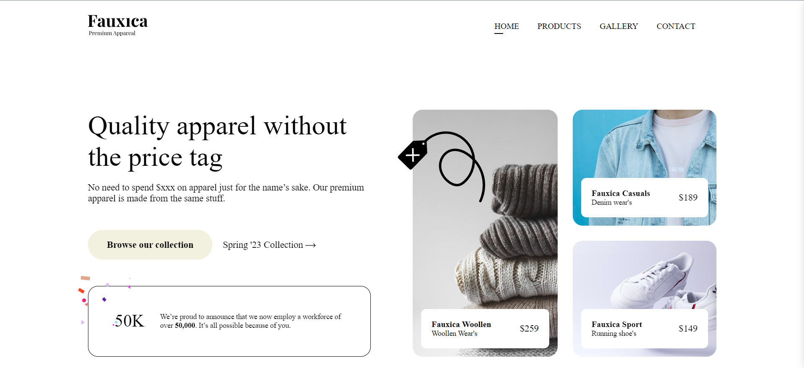

# Fauxica - Premium Apparel



Welcome to the Fauxica Premium Apparel website! This project is a modern, responsive landing page for showcasing premium apparel without the high price tag.

## 🎋 Intro

Fauxica is all about delivering high-quality apparel made from premium materials at affordable prices. Our website serves as a portal to explore our latest collections and highlights our commitment to quality and affordability.

## 📦 Tech Stack

- **HTML5**: Structure of the website.
- **CSS3**: Styling and layout.
- **JavaScript**: Interactive elements and animations.
- **SVG**: Scalable Vector Graphics for icons and logos.

### 🔍 Figma Design and Deployment:

- [Project Repository](https://github.com/GunaPalanivel/Fauxica.git)
- [Live Deployment](https://fauxica-xi.vercel.app/)
- [Figma Design](https://www.figma.com/design/itCs6m3rpccRZvzki6KOwk/Fauxica?node-id=0-1&t=WgNI37WDlfO5kqWX-1)

## 👩🏽‍🍳 Features

- **Responsive Design**: Adapts seamlessly to different screen sizes and devices.
- **Interactive Navigation**: User-friendly menu with smooth transitions.
- **Hero Section**: Engaging headline and call-to-action buttons.
- **Product Gallery**: Highlighting key products with detailed views and prices.
- **News Section**: Announcements and important updates for customers.

## 💭 Process

The project began with a clear vision to create an engaging and visually appealing website for Fauxica. The design focused on a clean, modern look with intuitive navigation and interactive elements to enhance user experience. Challenges included ensuring responsiveness across all devices and creating seamless animations.

## 📚 Learnings

Throughout the development process, we gained deeper insights into responsive design, advanced CSS techniques, and effective use of SVGs for scalable graphics. This project reinforced the importance of meticulous planning and user-centric design.

## ✨ Improvement

While the website meets its objectives, there is always room for improvement. Future enhancements could include:

- Adding a user login and profile management system.
- Integrating a real-time inventory and order tracking system.
- Enhancing accessibility features for a more inclusive user experience.

## 🚦 Running the Project

To run the Fauxica website locally, follow these steps:

1. Clone the repository:
   ```bash
   git clone https://github.com/GunaPalanivel/Fauxica.git
   ```
2. Navigate to the project directory:
   ```bash
   cd Fauxica
   ```
3. Open `index.html` in your preferred web browser to view the site.

## Contributing

If you'd like to contribute to this project, please follow these steps:

1. Fork the repository.
2. Create a new branch (`git checkout -b feature-branch`).
3. Make your changes.
4. Commit your changes (`git commit -m 'Add some feature'`).
5. Push to the branch (`git push origin feature-branch`).
6. Open a pull request.

## License

This project is licensed under the MIT License - see the LICENSE file for details.
